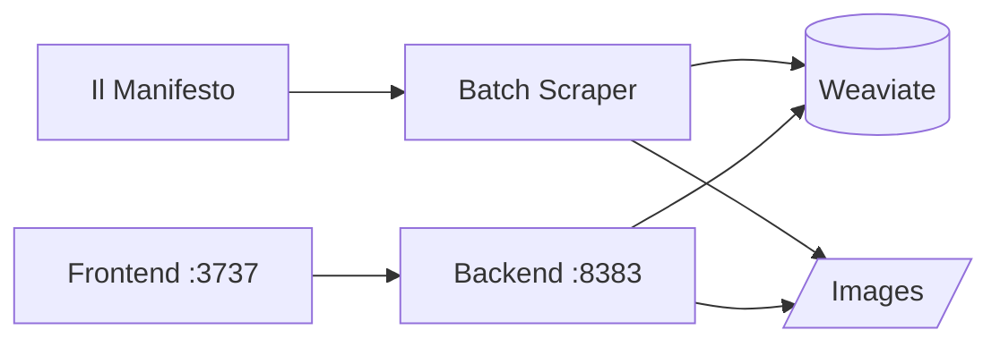
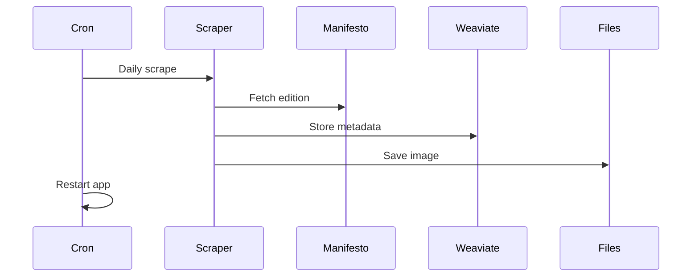

# Il Manifesto Copertine Archive

A full stack application to archive and search through the opening stories ("copertine") of Il Manifesto newspaper.

## Overview

This project provides a searchable archive of Il Manifesto's opening stories, with automated daily updates and a modern web interface.

## System Dependencies

1. **External Systems**
   - Il Manifesto digital edition webpage (source of daily articles)
   - Host filesystem with `/images` directory
   - Weaviate vector database with `Copertine` collection

2. **Infrastructure Requirements**
   - Docker and Docker Compose
   - Nginx server
   - Crontab for scheduling
   - Network connectivity to Il Manifesto website

## Architecture

The system consists of three main components:

1. **Batch Scraper**
   - Runs daily at 5:00 AM (Tuesday through Sunday)
   - Heuristically extracts opening article content:
     - Article title
     - Article kicker
     - Associated image
   - Saves images to `/images` directory
   - Stores metadata in Weaviate collection
   - Automated via crontab

2. **Backend Service (Python FastAPI)**
   - REST API for searching copertine
   - Interfaces with Weaviate vector database
   - Handles image processing and metadata extraction
   - Runs in Docker container on port 8383
   - Returns consolidated response with:
     - Article title
     - Article kicker
     - Image file path

3. **Frontend Application (Next.js 14)**
   - Web interface for browsing and searching copertine
   - Built with Next.js 14 and TypeScript
   - Uses pnpm for package management
   - Features server-side rendering and image caching
   - Runs in Docker container on port 3737

4. **Database (Weaviate)**
   - Vector database storing copertine metadata and search indices
   - Connected via Docker network
   - Provides strong BM25F text search capabilities

   **Collection Schema (`Copertine`)**
   ```
   Properties:
   - testataName (text)        : Publication name, non-searchable field
   - editionId (text)          : Unique identifier for each edition, non-searchable
   - editionDateIsoStr (date)  : Publication date
   - editionImageFnStr (text)  : Image filename reference, non-searchable
   - captionStr (text)         : Scraped caption text, non-filterable
   - kickerStr (text)          : Scraped news description, non-filterable
   - captionAIStr (text)       : AI-extracted caption, non-filterable
   - imageAIDeStr (text)       : AI-generated image description, non-filterable
   - modelAIName (text)        : LLM model used, non-searchable
   ```

   **Collection Configuration**
   - No vector indexing enabled (`vectorizer: none`)
   - Text fields use BM25F for search capabilities
   - Date field supports chronological operations
   - Field-level tokenization for exact matching where needed
   - Optimized for text search and filtering operations

## System Architecture

### Component Interaction Diagram


### Daily Update Process


## Data Flow

1. **Collection (Daily)**
   - Scraper fetches Il Manifesto digital edition
   - Extracts opening article content
   - Stores image in filesystem
   - Saves metadata to Weaviate

2. **Retrieval**
   - Frontend sends search/browse requests
   - Backend queries Weaviate collection
   - Returns consolidated response
   - Frontend displays results with image previews

## Setup

### System Requirements

1. **Hardware Requirements**
   - Sufficient disk space for image storage in `/images` directory
   - Minimum 4GB RAM recommended for Docker containers
   - Network connectivity to Il Manifesto website

2. **Software Prerequisites**
   - Docker Engine 20.10+
   - Docker Compose 2.0+
   - Nginx 1.18+
   - Crontab access
   - Weaviate 1.19+ instance

### Initial Setup

1. **Repository Setup**
   ```bash
   git clone [repository-url]
   cd copertinefull
   ```

2. **Directory Structure**
   ```
   copertinefull/
   ├── images/           # Image storage directory
   ├── frontend/         # Next.js frontend application
   ├── backend/         # FastAPI backend service
   └── docker-compose.yml
   ```

3. **Environment Configuration**
   Create `.env` file in the backend directory:
   ```env
   COP_WEAVIATE_URL=127.0.0.1
   COP_WEAVIATE_API_KEY=your_weaviate_api_key
   COP_COPERTINE_COLLNAME=Copertine
   COP_VISION_MODELNAME=gpt-4-vision-preview
   COP_OLDEST_DATE=2013-03-27
   ```

### Container Deployment

1. **Start Services**
   ```bash
   docker-compose up -d copback    # Start backend service
   docker-compose up -d copfront   # Start frontend service
   ```

2. **Verify Deployment**
   ```bash
   docker-compose ps               # Check container status
   curl http://localhost:8383/health  # Verify backend health
   curl http://localhost:3737         # Verify frontend access
   ```

### Nginx Configuration

Add to your Nginx configuration:
```nginx
    location /copertine {
        proxy_pass http://127.0.0.1:3737;
        # Basic proxy headers
        proxy_set_header Host $host;
        proxy_set_header X-Real-IP $remote_addr;
        proxy_set_header X-Forwarded-For $proxy_add_x_forwarded_for;
        proxy_set_header X-Forwarded-Proto $scheme;
        # Updated Permissions-Policy with only widely supported features
        add_header Permissions-Policy "camera=(), microphone=(), geolocation=(), payment=()";
        proxy_redirect off;
        proxy_http_version 1.1;
        proxy_set_header Upgrade $http_upgrade;
        proxy_set_header Connection "upgrade";
    } 


    location /images/ {
        alias /home/mema/code/copertinefull/images/;
        http2_push_preload on;
        autoindex off;
        
        # Aggressive caching for images since they never change
        expires max;
        add_header Cache-Control "public, max-age=31536000, immutable";
        
        # Performance optimizations
        sendfile on;
        tcp_nopush on;
        tcp_nodelay on;
        aio threads;
        directio 512;  # For files larger than 512 bytes
        
        # Security headers
        add_header X-Content-Type-Options "nosniff";
        
        # Only allow GET and HEAD
        limit_except GET HEAD {
            deny all;
        }
        
        # Optional: Enable compression for JPEG if not already compressed
        # gzip on;
        # gzip_types image/jpeg;
        # gzip_min_length 1024;
    
        # Optional but recommended: Cross-Origin settings
        add_header Access-Control-Allow-Origin "https://dev.isagog.com";
        add_header Access-Control-Allow-Methods "GET, HEAD, OPTIONS";
        add_header Timing-Allow-Origin "https://dev.isagog.com";
    }
```

**Important Configuration Notes:**
- The port in the `/copertine` location (3737) must match your frontend container's exposed port
- The path in the `/images/` location (`/home/mema/code/copertinefull/images/`) must be updated to match your actual host system path where images are stored

### Batch scraping Setup

1. **Create Update Script**
   Create `refreshbind.sh` in project root:
   ```bash
   #!/bin/bash

   # Run the scraping process (verify the path is correct)
   /home/mema/code/copertinefull/backend/.venv/bin/python /home/mema/code/copertinefull/backend/src/scrape2.py

   # Restart the container
   /usr/bin/docker compose --project-directory /home/mema/mema_docker_compose/ stop copfront
   /usr/bin/docker compose --project-directory /home/mema/mema_docker_compose/ start copfront
   ```

2. **Make Script Executable**
   ```bash
   chmod +x refreshbind.sh
   ```

3. **Configure Crontab**
   Add to crontab (runs at 5:00 AM, Tuesday through Sunday):
   ```bash
   0 5 * * 2-7 /home/mema/code/copertinefull/refreshbind.sh >> /home/mema/code/copertinefull/backend/scrape2.log 2>&1
   ```

### Verification

1. **Test Scraper**
   ```bash
   ./refreshbind.sh  # Run manual scrape
   ls -l images/     # Check for new images
   ```

2. **Monitor Logs**
   ```bash
   tail -f backend/scrape2.log  # Check scraper logs
   docker-compose logs -f       # Check container logs
   ```

## Development

### Frontend
- Located in `/frontend`
- Next.js 14 with TypeScript
- Tailwind CSS for styling
- Client-side caching for performance
- Docker container with mounted volumes

### Backend
- Located in `/backend`
- FastAPI application
- Poetry for dependency management
- Weaviate integration
- Docker container with mounted volumes

## Features

- Full-text BM25F search
- Image preview on hover
- Detailed image modal view
- Sort by date or relevance
- Responsive design
- Fast search response times

## License

[License information to be added]
