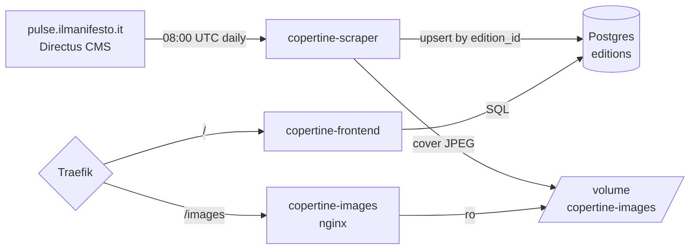

# Copertine — il manifesto's front-page archive

A searchable archive of *il manifesto*'s daily front pages ("copertine"): 4500+
editions back to 2013-03-27, each with its cover image, headline and kicker, updated
every morning from the paper's CMS.

Live at **https://copertine.ilmanifesto.it**.

## What this repo is

The **application** — three container images, built by CI and published to GHCR:

| Image | Built from | What it is |
|---|---|---|
| `ghcr.io/isagog/copertine-frontend` | [`frontend/`](frontend/) | Next.js 15 app: the grid, the search UI, and the API routes that query Postgres |
| `ghcr.io/isagog/copertine-scraper` | [`backend/`](backend/) | `sd2.py` plus a scheduler that runs it daily at 08:00 UTC |
| `ghcr.io/isagog/copertine-images` | [`nginx/`](nginx/) | nginx serving the cover JPEGs off a Docker volume |

The **deployment** lives elsewhere, in
[`Isagog/isagog-platform-dokploy`](https://github.com/Isagog/isagog-platform-dokploy)
under `copertine/` — a Dokploy Compose app on mema4. That split is deliberate: Dokploy
takes a full clone of whatever repo it deploys from onto the host, and mema4 is
customer-owned, so the deployment repo carries only topology and config while this
repo's source stays off the machine. flow2 and pdfmanifesto are structured the same
way.

## Architecture


```mermaid
graph LR
    D[pulse.ilmanifesto.it<br/>Directus CMS] -->|08:00 UTC daily| S[copertine-scraper]
    S -->|upsert by edition_id| P[(Postgres<br/>editions)]
    S -->|cover JPEG| V[/volume<br/>copertine-images/]
    F[copertine-frontend] -->|SQL| P
    T{Traefik} -->|/| F
    T -->|/images| N[copertine-images<br/>nginx]
    N -->|ro| V
```

There is no separate API service. An earlier design put a FastAPI `copback` and a
Weaviate vector database in this path; both were removed once it was clear the app
only ever used keyword search, which Postgres does natively. See
[`docs/current_analysis.md`](docs/current_analysis.md) for that reasoning — it is
kept as history and describes the *old* mema3 topology, not this one.

### Search

Everything runs in Postgres, through three independent switches the UI exposes:

| Switch | Options | Implementation |
|---|---|---|
| **Corrispondenza** | Esatta / Varianti | literal match via `cop_norm()` vs. `tsquery` against a `tsvector` |
| **Granularità** | Parola intera / Stringa | word-boundary regex vs. substring. Only meaningful under *Esatta* — `Varianti` runs on a tokenized vector, so it is always word-level |
| **Ambito** | Solo titolo / Tutto il testo | `caption_vector` vs. `search_vector` (caption weight A + kicker weight B) |

Two pieces of schema make this work, both in
[`backend/src/setup_db.sql`](backend/src/setup_db.sql):

- **`italian_unaccent`** — a text search configuration copying `italian` with
  `unaccent` in the mapping, so stemming and accent-folding happen together.
- **`cop_norm(text)`** — folds case, accents, and the three apostrophe forms the
  corpus mixes (the archive has both ASCII `'` and typographic `’`). It is `IMMUTABLE`
  via the two-argument `unaccent()` form specifically so the planner can inline it.

Sorting by relevance is only offered where a rank exists (`Varianti` + a non-empty
query); the API route silently falls back to date order otherwise.

### Scraping

`backend/src/sd2.py` reads the cover article from Directus at
`pulse.ilmanifesto.it/items/articles`, filtered to `articleEditionPosition = 1`.

The date handling is the subtle part: **il manifesto publishes each edition's cover at
Rome-local midnight**, which is 22:00–23:00 *UTC the day before*. Directus stores true
UTC, so both the query window and the stored `edition_date` are computed in
Rome-local calendar days. 08:00 UTC is chosen as a comfortable buffer after that.

Upserts are keyed on `edition_id` (`DD-MM-YYYY`), so re-running is idempotent. The
container re-fetches the last `COP_SCRAPE_LOOKBACK_DAYS` (default 3) on every run,
which is what makes a missed day self-heal without any catch-up bookkeeping.

## Layout

```
frontend/          Next.js 15 app (TypeScript, Tailwind, pnpm)
  app/api/         API routes — the only thing that talks to Postgres
  app/copertine/   the archive page; `/` redirects here
  Dockerfile       standalone output, non-root, self-contained CMD
backend/
  src/sd2.py       the Directus scraper
  src/setup_db.sql schema, italian_unaccent config, cop_norm()
  src/migrations/  incremental schema changes
  docker/          scrape-loop.sh — the daily scheduler
  tools/           occasional diagnostics (Directus gaps, date-file generation)
nginx/             the image-serving container
docs/              design history — see the header on current_analysis.md
```

## Development

Requires `pnpm` and `uv`. The dev server needs a database; `make local-up` opens a
tunnel to the one on mema4 (two hops — see the Makefile header for why) and starts
`next dev`.

```bash
make local-up          # tunnel + next dev on :3000
make local-down        # tear both down
make images            # build all three images locally, as CI does
```

Set `DATABASE_URL` in `frontend/.env.local` to point at the tunnel:

```
DATABASE_URL=postgresql://copertine_app:<password>@localhost:5432/copertine
```

Lint and type-check the scraper with `uv run ruff check` and `uv run mypy src`.

## Configuration

Nothing secret is committed. In production both of these come from Dokploy's
Environment tab; locally they come from `.secrets` (gitignored) for the scraper and
`frontend/.env.local` for the frontend.

| Variable | Used by | Purpose |
|---|---|---|
| `DATABASE_URL` | both | Postgres connection string |
| `DIRECTUS_API_TOKEN` | scraper | Bearer token for pulse.ilmanifesto.it |
| `COP_IMAGES_DIR` | scraper | where covers are written (`/images` in the container) |
| `COP_SCRAPE_AT_UTC` | scraper | daily fire time, `HH:MM` (default `08:00`) |
| `COP_SCRAPE_LOOKBACK_DAYS` | scraper | days re-fetched per run (default `3`) |
| `COP_SCRAPE_ON_START` | scraper | run once at container start (default `false`) |
| `COP_LOG_FILE` | scraper | optional log file; unset means stderr only |

## Deploying

Merge to `main` → CI builds and pushes the changed images to GHCR → **Redeploy** the
`copertine` app in Dokploy on mema4. Nothing is ever built on the deployment host,
and nothing on it should ever be hand-edited.

To roll back, pin `IMAGE_TAG` to a commit SHA in Dokploy's Environment tab rather
than reverting and rebuilding.

Full runbook — first deploy, database provisioning, volume seeding, verification —
is in
[`isagog-platform-dokploy/copertine/README.md`](https://github.com/Isagog/isagog-platform-dokploy/blob/master/copertine/README.md).
